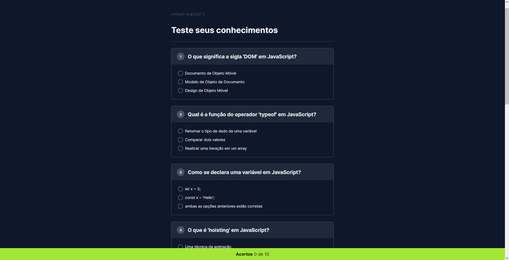

<h1 align="center"> NLW IA </h1>

Projeto construído na 13º edição do evento Next Level Week da Rocketseat. 🚀🔥

  <a href="#-tecnologias">Tecnologias</a>&nbsp;&nbsp;&nbsp;|&nbsp;&nbsp;&nbsp;
  <a href="#-projeto">Projeto</a>&nbsp;&nbsp;&nbsp;|&nbsp;&nbsp;&nbsp;
  <a href="#-links">Links</a>

 

  

> Trilha Foundations

A trilha Foundations do evento abrange tecnologias básicas do desenvolvimento web, focando nas possibilidades de uso de inteligência artificial.

## 🚀 Tecnologias

Esse projeto foi desenvolvido com as seguintes tecnologias:

- HTML 
- CSS
- Figma
- JavaScript
- NodeJS
- Inteligência Artificial
- Git e Github

      

## 💻 Projeto

O Shorts Summary é um projeto que utiliza das tecnologias de inteligência artificial para resumir o conteúdo de Shorts do YouTube de até 60 segundos.

## 🔗 Links

 